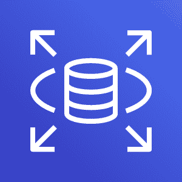
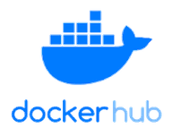

### Elastic Compute Cloud (EC2)

In this architecture, **AWS EC2** provides scalable virtual servers. An EC2 instance hosts the **public-app** (the web application) and runs Jenkins to manage CI/CD jobs. This allows Jenkins to execute the pipeline, including building, testing, and deploying the web application.

### Relational Database Service (RDS)

The **private-db** is hosted on **AWS RDS**, which manages your database infrastructure. It is placed in a **private subnet** to prevent direct internet access, enhancing security for sensitive data. The application running on EC2 will communicate with the database securely within the same VPC using appropriate security groups and IAM roles ( not use in this guide).

### Docker Hub

**Docker Hub** serves as a container registry for storing your Docker images. After building the application through Jenkins, the Docker image is pushed to Docker Hub, which is then pulled and deployed onto the EC2 instance. This decouples the container storage from AWS's native container services, providing flexibility but may require additional security configurations.

### GitHub

**GitHub** is used as the version control system for hosting your project’s source code. Jenkins is integrated with GitHub, allowing it to detect changes in the repository (such as a new pull request or a commit to a branch). Once a change is detected, Jenkins initiates the CI/CD pipeline defined in the **Jenkinsfile** stored within the repository.

### Jenkins

**Jenkins** runs on an EC2 instance and manages the CI/CD pipeline. It detects code changes in the GitHub repository, builds the Docker image, performs tests, and then pushes the image to Docker Hub. Jenkins then triggers the deployment process, updating the EC2 instance with the new version of the web application. Jenkins also integrates with SonarQube for code quality checks.

### SonarQube

**SonarQube** is used to perform static code analysis, ensuring code quality and security. It is integrated into the pipeline and runs on an EC2 instance, scanning the source code during each pull request or as part of the build process. This helps to catch bugs and vulnerabilities early in the development cycle.

### CI/CD Pipeline Overview

1. **Commit to GitHub**: A developer commits code to the GitHub repository.
2. **Jenkins detects changes**: Jenkins triggers the CI/CD pipeline based on the changes detected.
3. **Build and test**: Jenkins builds the application, runs tests, and performs a SonarQube scan to check for code quality and security issues.
4. **Push to Docker Hub**: After a successful build, Jenkins pushes the Docker image to Docker Hub.
5. **Deploy**: Jenkins deploys the latest Docker image to the EC2 instance, updating the public-facing web application.