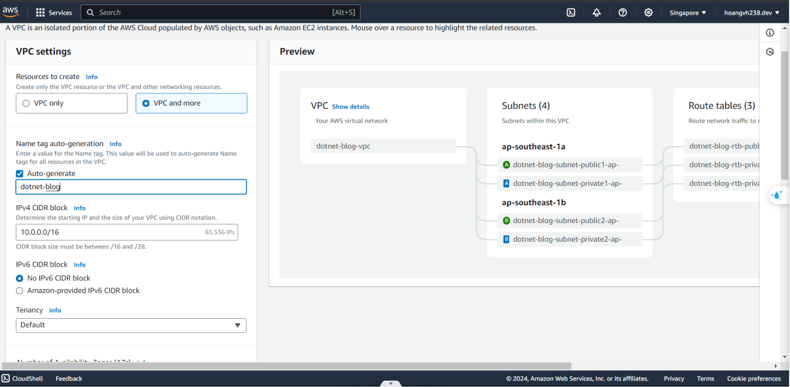

**Step 1. Search VPC** 

.png)

**Step 2. Create new VPC**

.png)

**Step 3. Setup and create**

- Depending on your requirements, you can choose 1-3 Availability Zones (AZs) if you want to deploy an additional load balancer.
- You can opt for NAT gateways if you need to connect a private subnet to the external internet.

