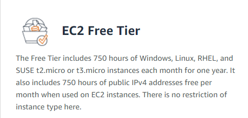
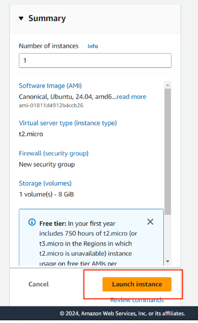

### Step 1. Search “EC2” and Launch New Instance

- ***When you run 2 EC2 with 2h ⇒ It mean you already used 2*2 = 4 / 750 free hours .***

### Step 3. Setup New EC2

.png)

.png)

.png)

.png)

.png)

.png)

.png)

- ***When you create 2 EC2 with each have 8GB ⇒ It mean total 16GB / 30 GB free.***

.png)

### Step 4. **Launch instance**

