***Doesn't lead to new long-term, low-cost, or free work, you should conserve resources by skipping it.***

### Step 1.

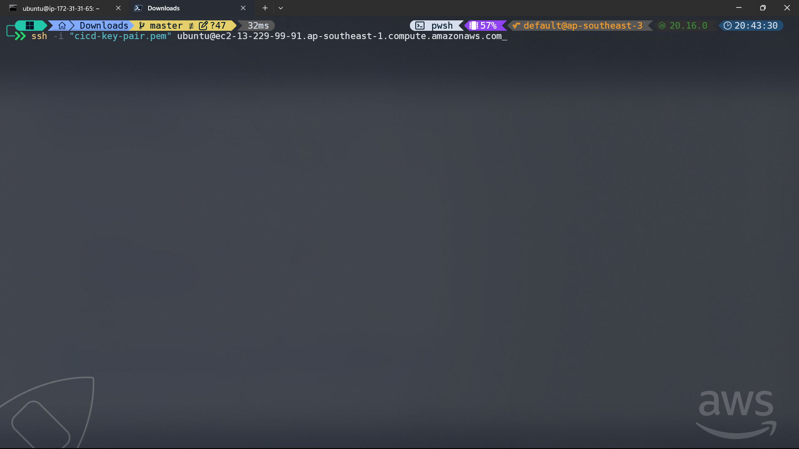

### Step 2.

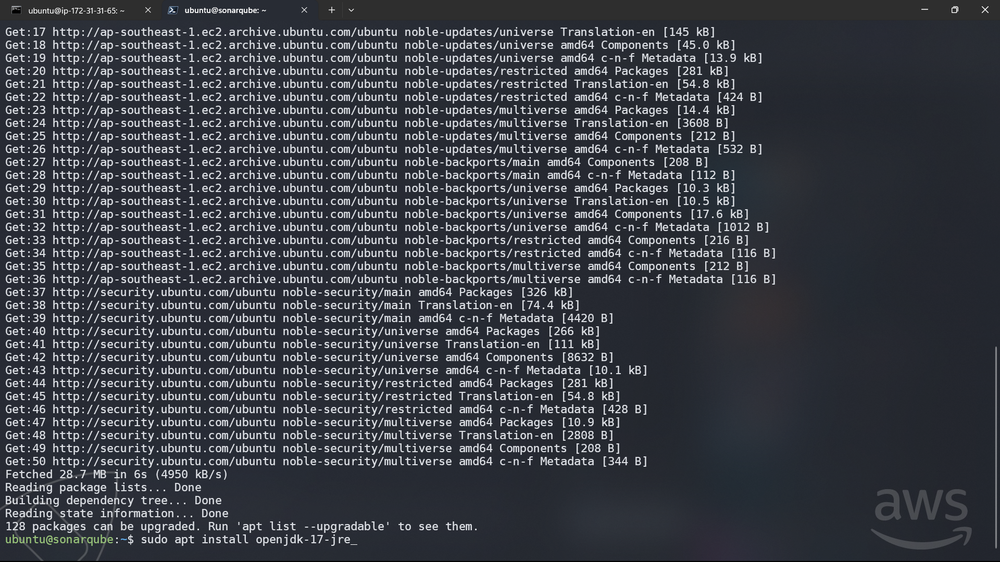

### Step 3.

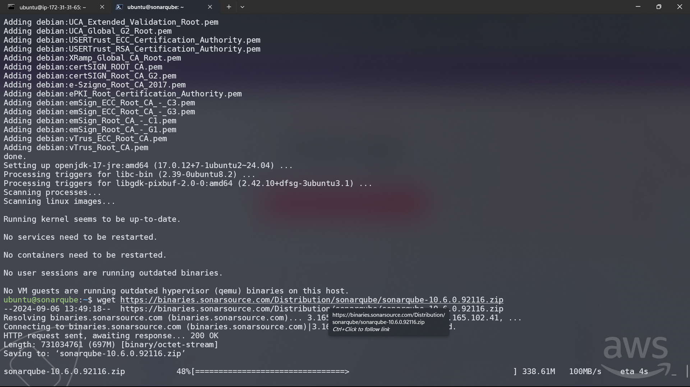

### Step 4.

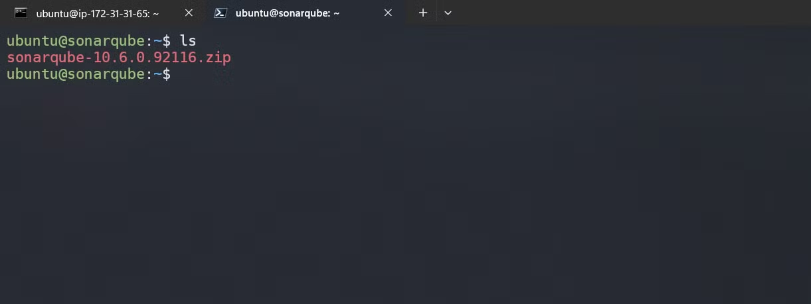

### Step 5.

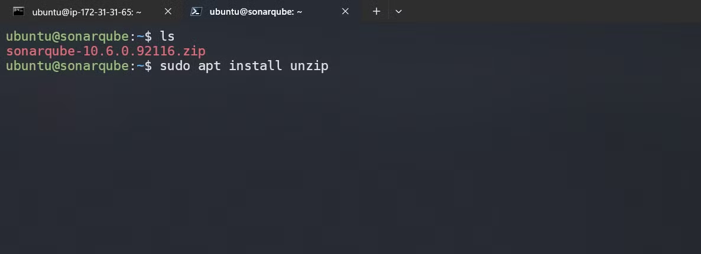

### Step 6.

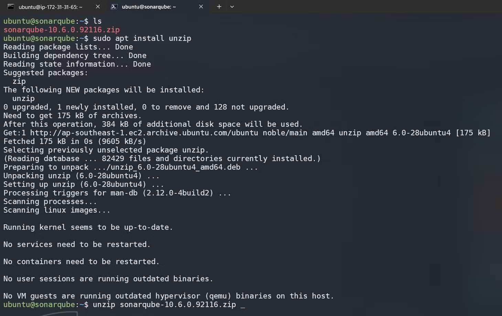

### Step 7.
- Change console to start to run with background services
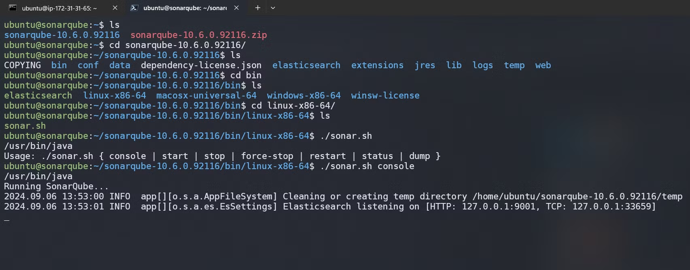

### Step 8.

- Default account is :
    - *Login : admin*
    - *Password: admin*
- Login and change it.

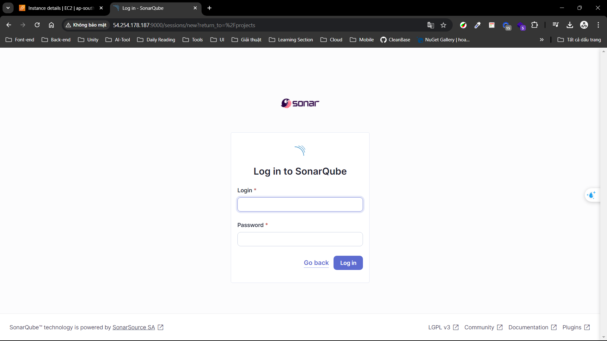

### Step 9.

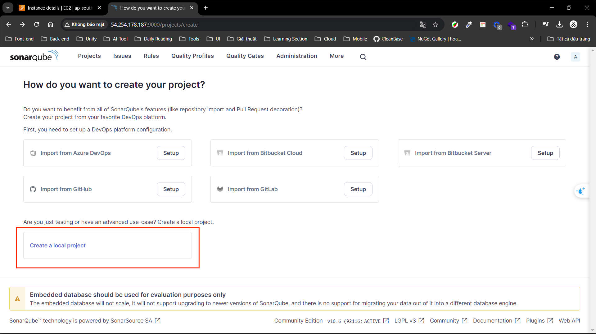

### Step 10.

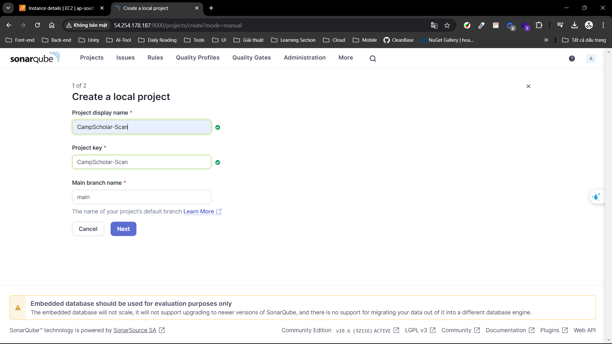

### Step 11.

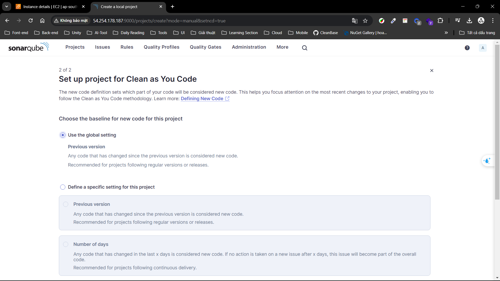

### Step 12.

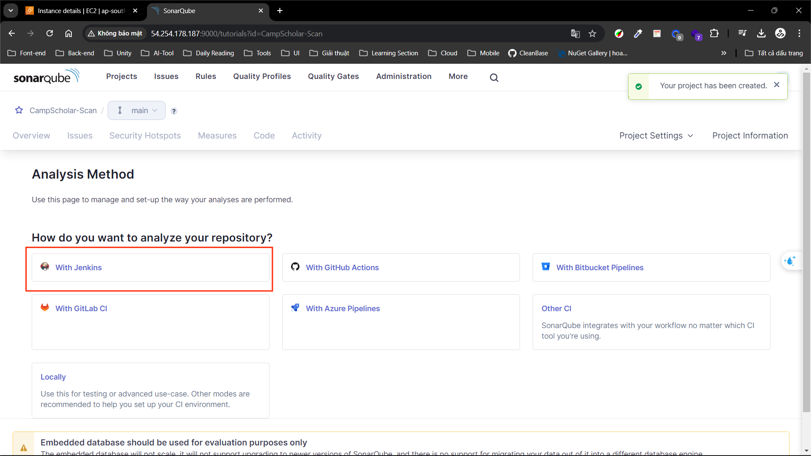

### Step 13.

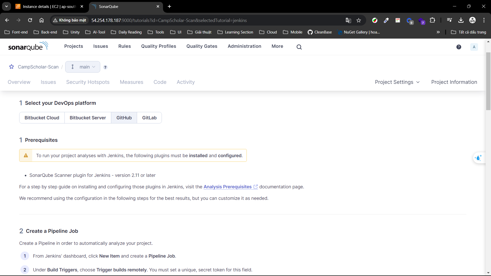

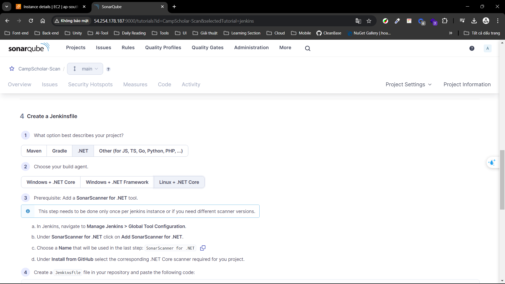

- You can use below code or my Jenkinfile https://github.com/hoangvh238/Blog-razor-page/blob/main/Jenkinsfile-CI

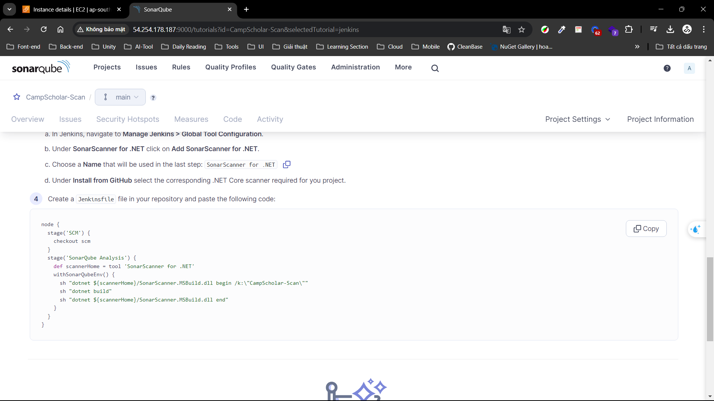

### Step 14.

- Generate and save it. This key will create and store in Jenkins credientals.

**>> Let  go back Jenkin dashboard**