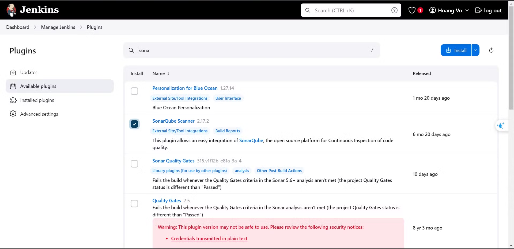
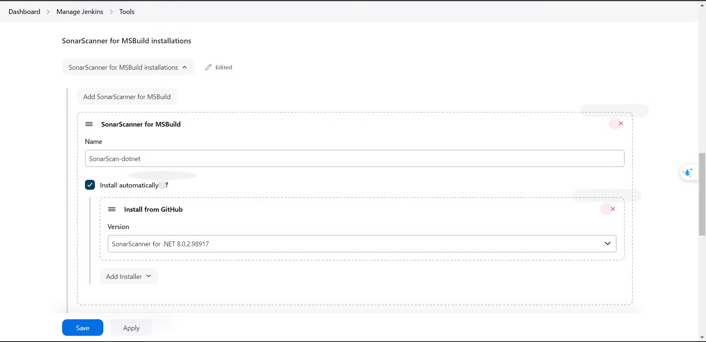
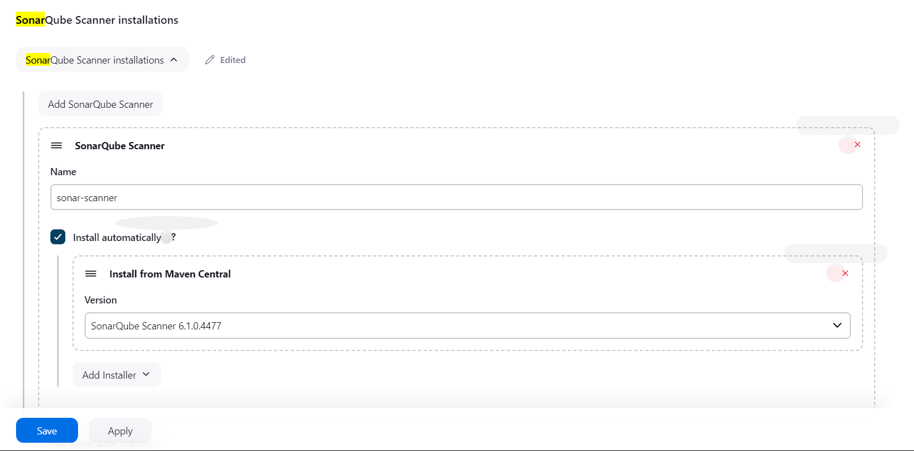
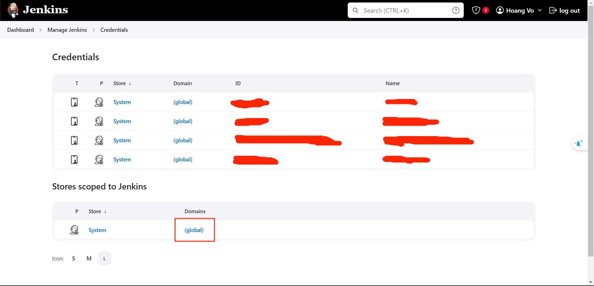
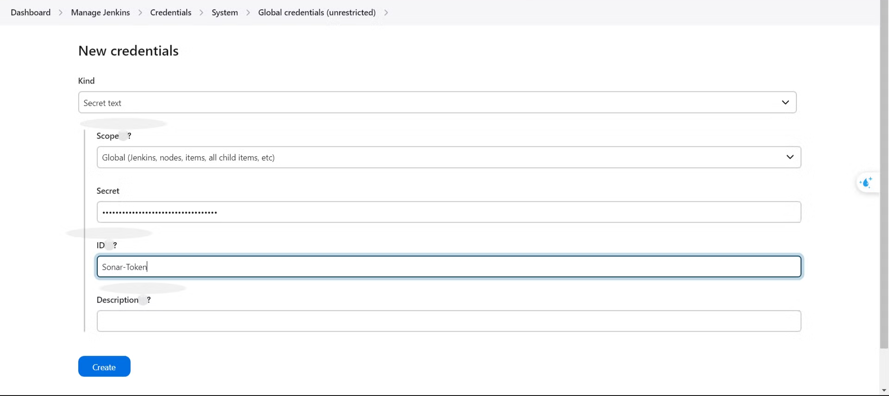
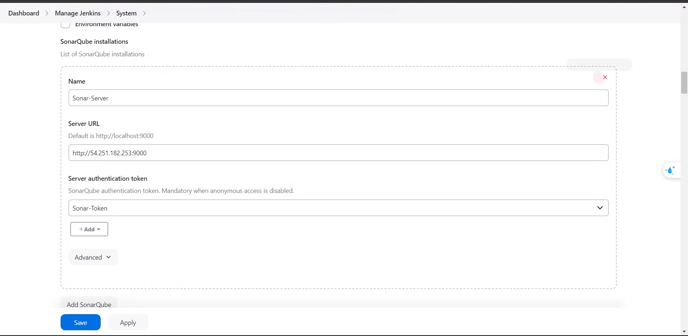

### Step 1. Install plugins

- Access *Dashboard/Manage Jenkin/Plugins* and install **SonarQube Scanner.**

### Step 2. Config plugins

- .NET projects must use MSBuild. If you're not using .NET, you can configure the plugin as shown below:

- Nodejs or anything

### Step 3. Create new SonarQube credentails

- Access *Dashboard/Manage Jenkin/Credentials a*nd create new *Credentials*  **.**

- In the "**Secret**" field, paste the key you last created in the SonarQube dashboard.

### Step 4. Config global variance for plugins

