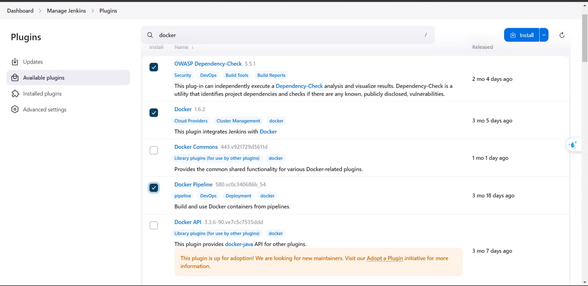
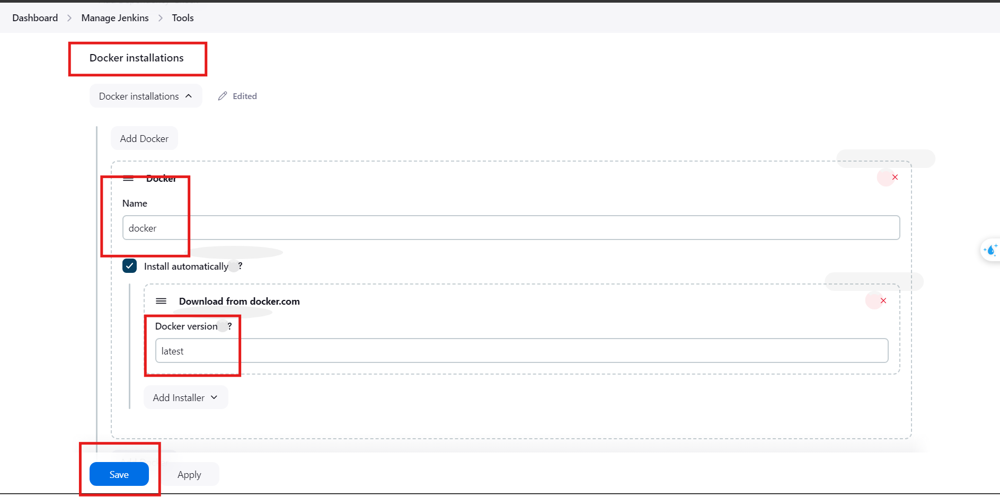
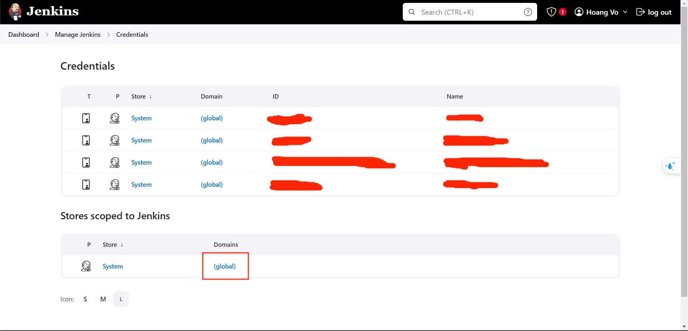
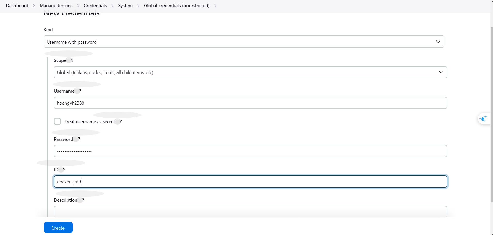

### Step 1. Install docker plugin

- Access : *Dashboard/Manage Jenkins/Plugin* and search *docker*

### Step 2. Config plugin

- Access : Dashboard/Manage Jenkins/ Tools and setting with below.

### Step 3. Create  docker credentials

- Access *Dashboard/Manage Jenkin/Credentials a*nd create new *Credentials*  **.**

- The username and password should be your Docker Hub account credentials.

