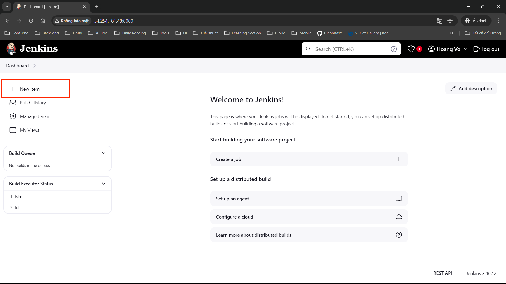
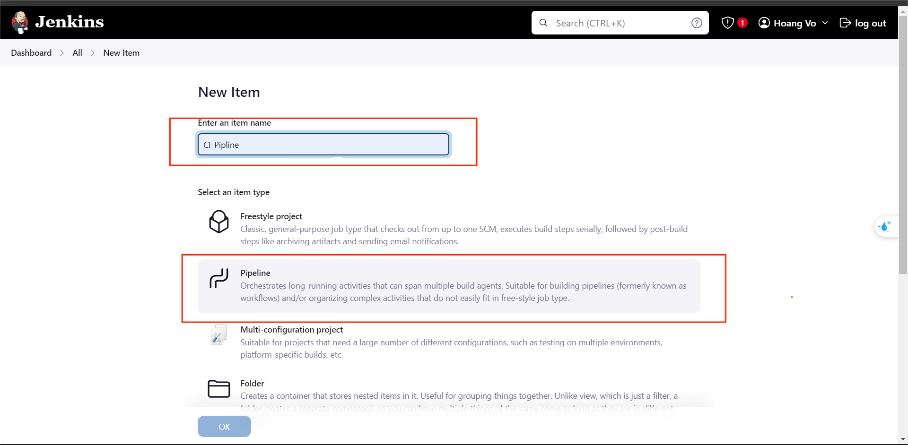
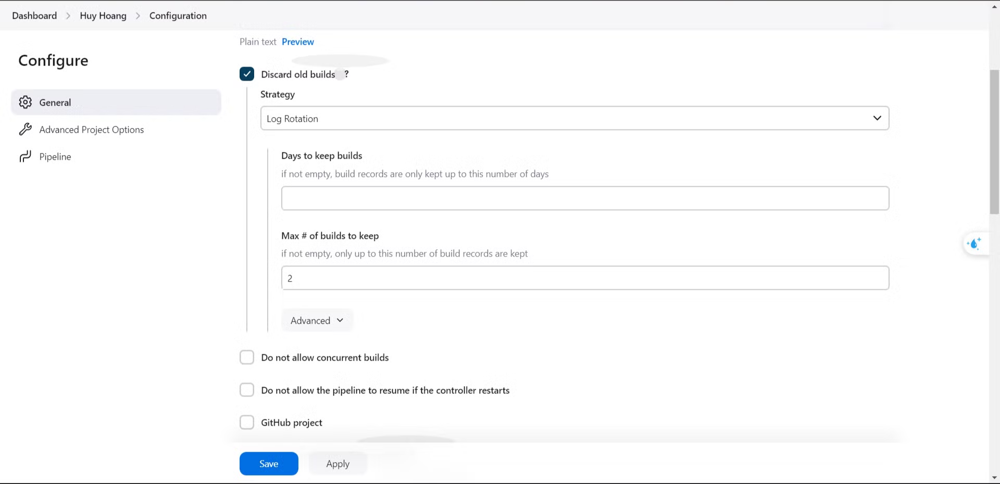

### Step 1.

### Step 2.

- You can choice “Freestyle project” if want setup with UI.

### **Step 3.**

- When you set the maximum to "2", Jenkins will remove all build history except for the two most recent builds. It help Jenkins not use a disk resource waste.

You can use Jenkinfile of me : https://github.com/hoangvh238/Blog-razor-page/blob/main/Jenkinsfile

[5.1.3.1. Setup SonarQube ( optional )](./5.1.2.1-Setup%20SonarQube%20(%20optional%20)/_index.md)

[5.1.3.2. Setup Sonar plugin ( optional)](./5.1.2.2-Setup%20Sonar%20plugin%20(%20optional)/_index.md)

[5.1.3.3 Setup Docker](./5.1.2.3-%20Setup%20Docker//_index.md)

[5.1.3.4 Create GitHub webhook](./5.1.2.4-%20Create%20GitHub%20webhook//_index.md)