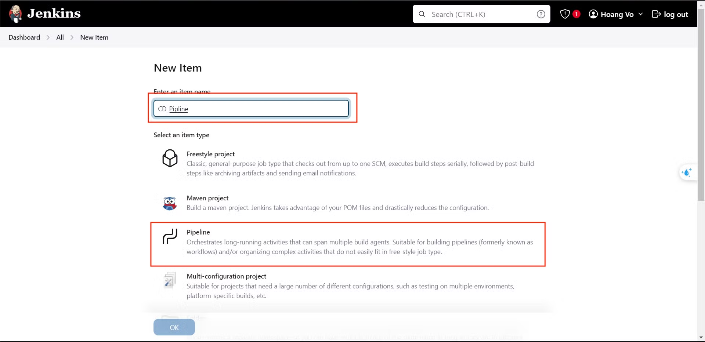
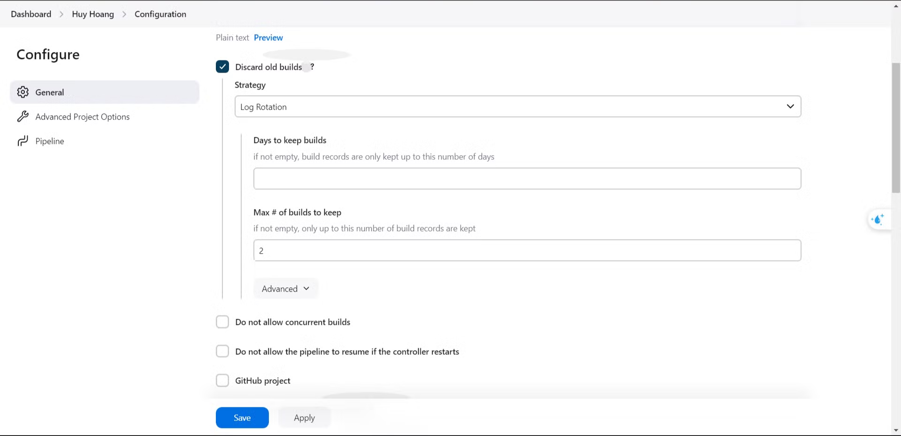
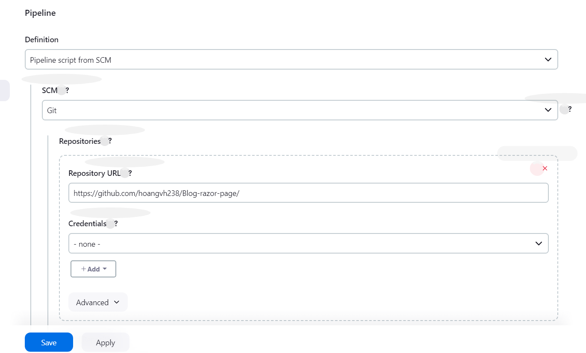
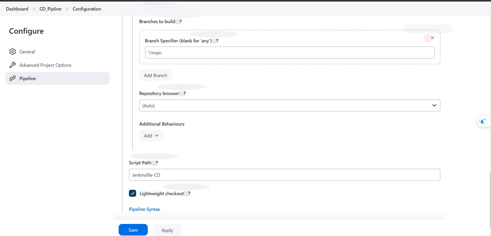
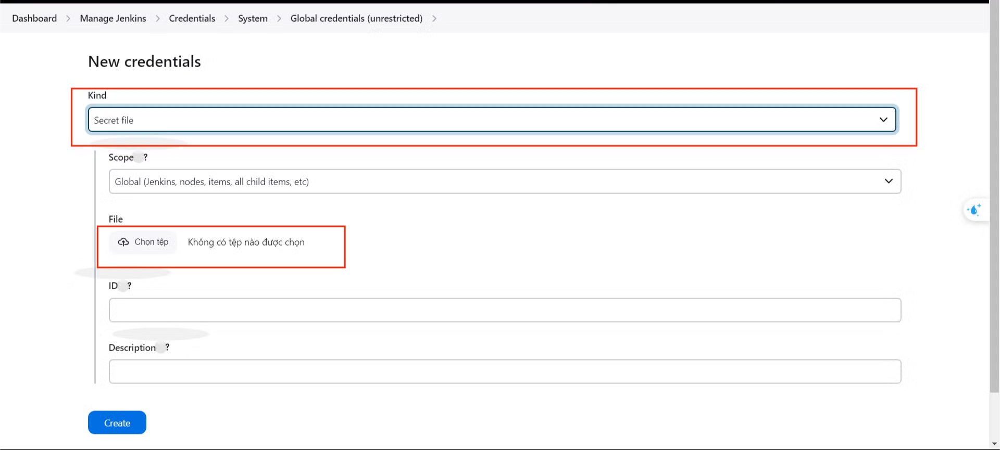

### Step 1.

### **Step 2.**

- When you set the maximum to "2", Jenkins will remove all build history except for the two most recent builds. It help Jenkins not use a disk resource waste.

### Step 3.

- Change Kind to “Secret file” and upload your key.pem

.png)