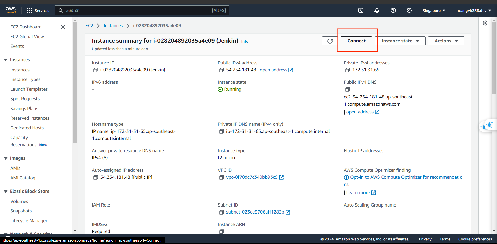
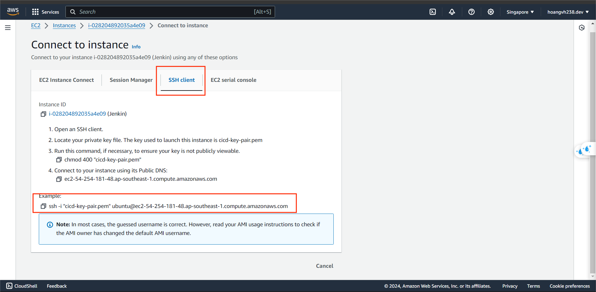
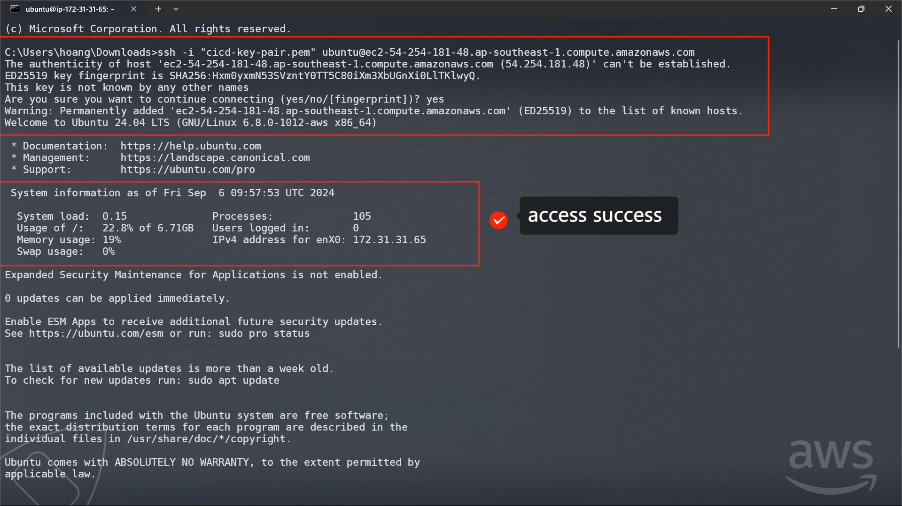
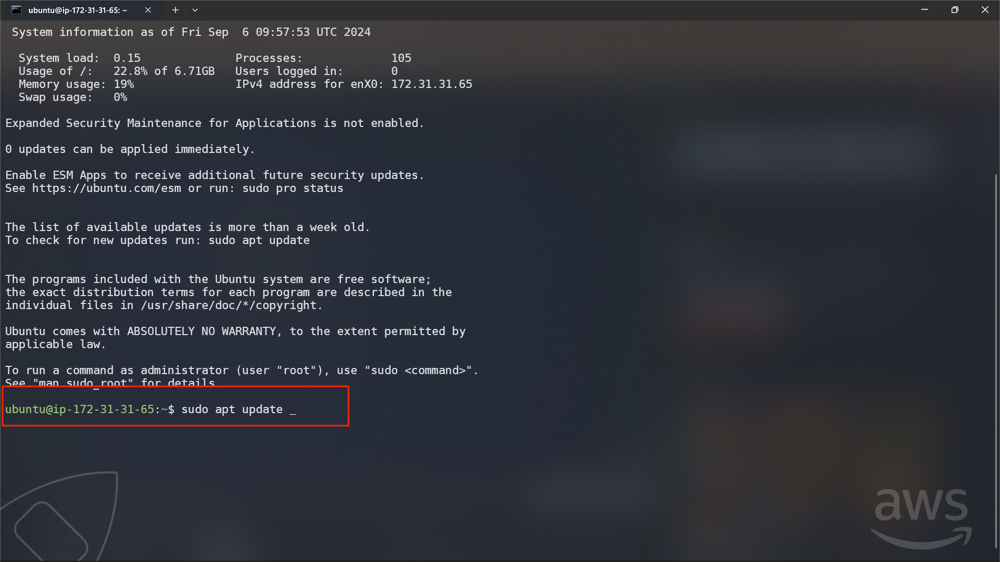
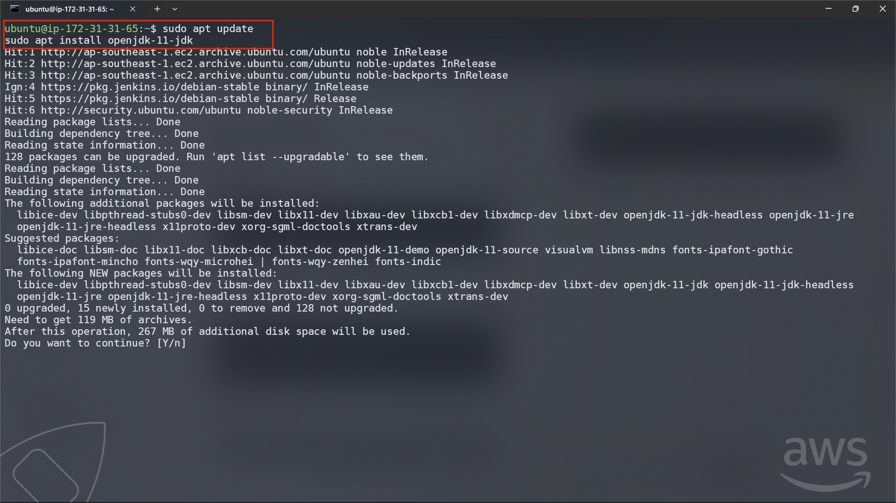
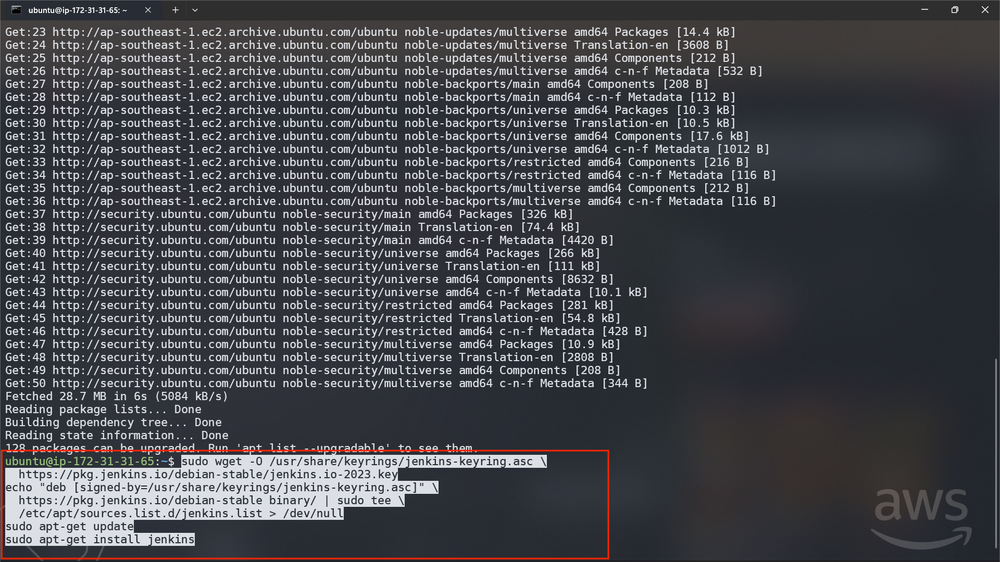
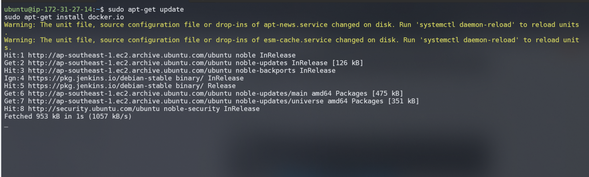
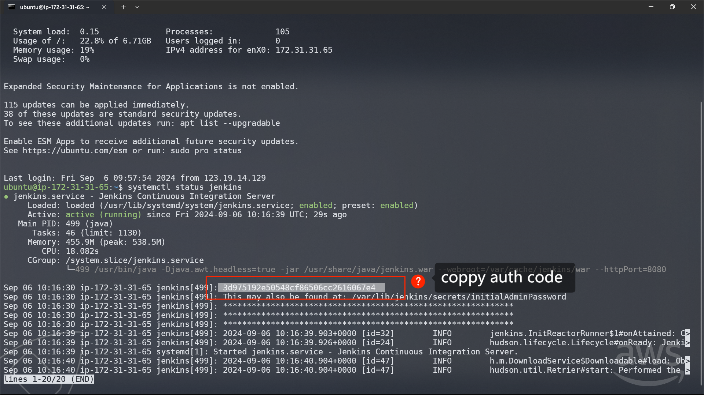

### Step 1. Get access script

### Step 2. Access to Jenkins instance by SSH

- You must navigate to the folder containing "cicd-key-pair.pem". In this case, I've saved it in **Downloads**.
- Paste the code of above

### Step 3. Install JRE

- Installing JRE first prevents Jenkins from needing to reboot during its installation or encountering issues with the Java environment.
- install JRE 17 : `sudo apt install openjdk-17-jre`
- you can ref in : https://www.jenkins.io/doc/book/installing/linux/

### Step 4. Install Jenkins

### Step 5. Get Jenkin auth Code

- Using `sudo systemctl status jenkins`

[5.1.1. Setup Jenkin dashboard](./5.1.1-Setup%20Jenkin%20dashboard/_index.md)

[5.1.2. Create CI pipeline](./5.1.2-Create%20CI%20pipeline/_index.md)

[5.1.3. Create CD pipeline](./5.1.3-Create%20CD%20pipeline/_index.md)