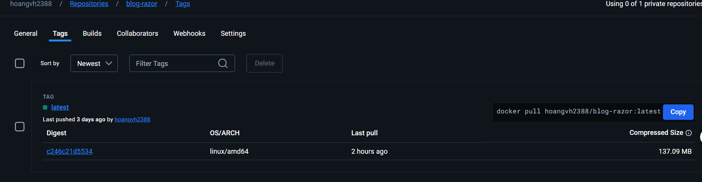
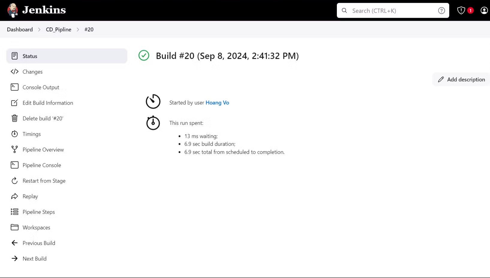

### Check image build after CI pipeline

### Check status CD

### The Script of Jenkinfile will check and do “Code First” with EF Core

### Access production (access through port 80/hhtp as defined in the security group)

.png)