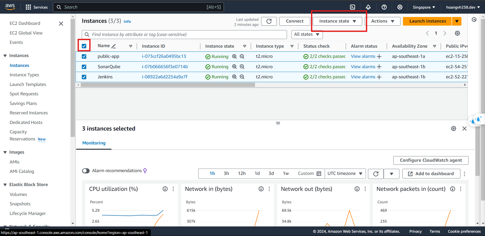
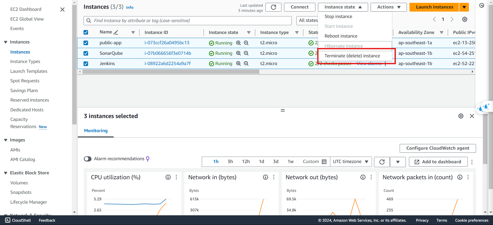
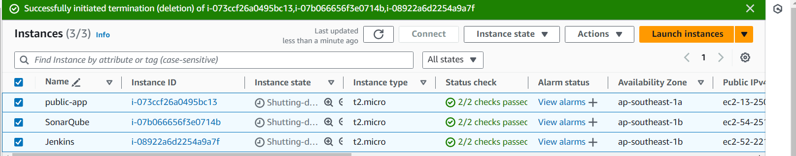
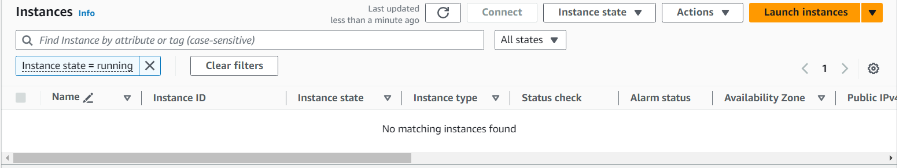
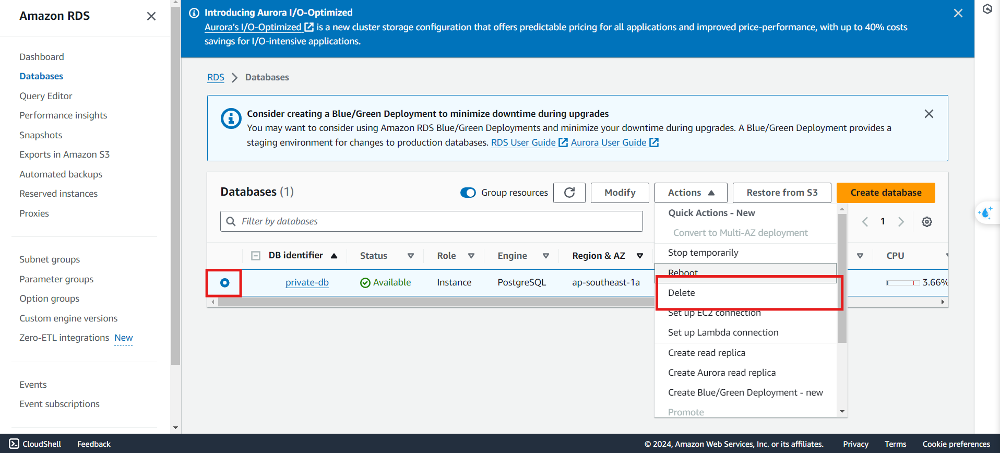
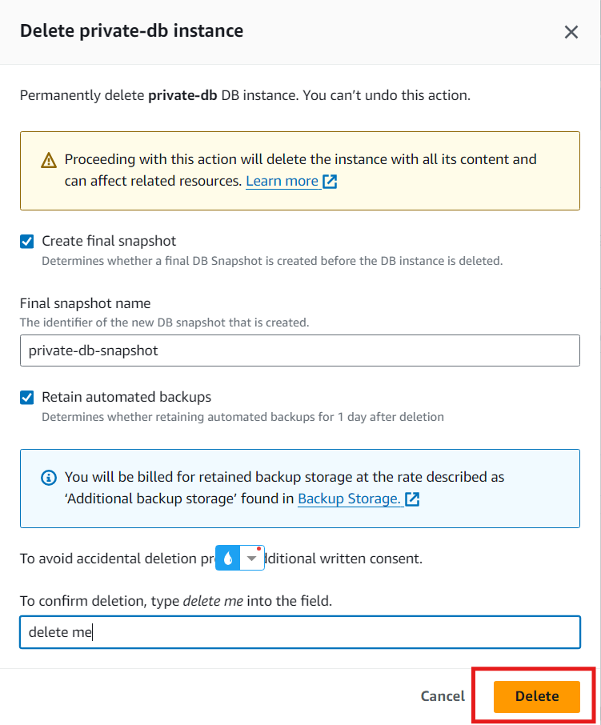
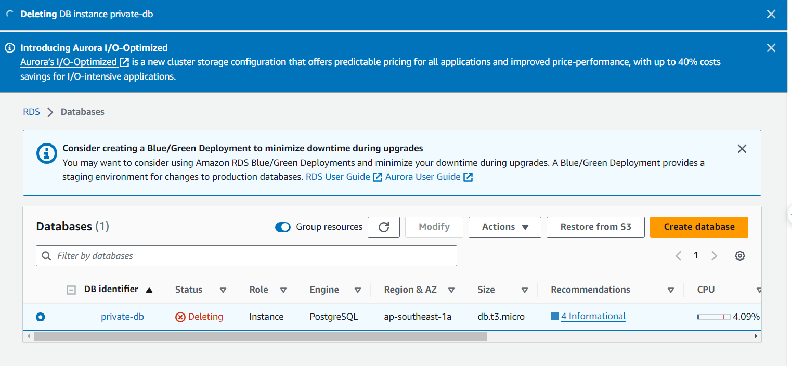
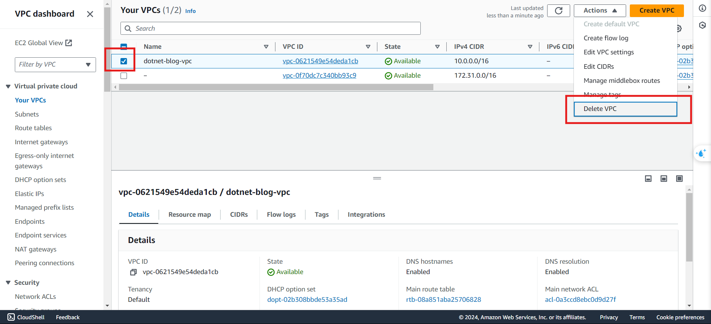
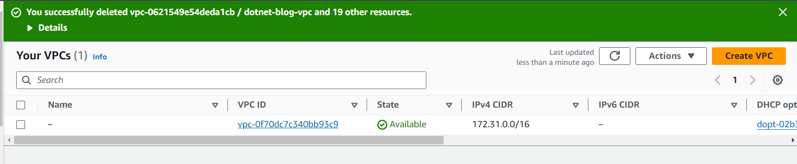

## **"When clearing resources, ensure to delete them and wait until the service is fully stopped before leave.”**

## Step 1. Delete EC2

- Complete when “No matching instances found” !

## Step 2. Delete RDS

## Step 3. Delete VPC

